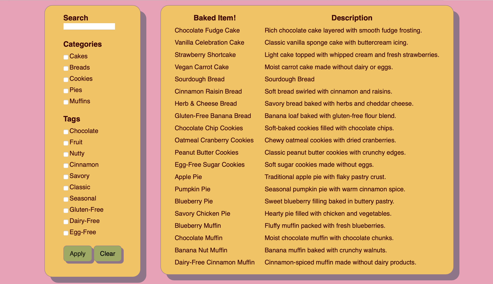

# Product Catelog


## Description
Remarcable Inc assignment demonstrating skills related to the job. This assignment involved building a simple Django project that models products, categories, and tags. 

## Getting Started

#### Requirements
- Python 3.11+

#### Installation
- Downloadand unzip file from GitHub
- initialize a python virtual environment:
    ```
    python3 -m venv .venv
    ```
- Activate virtual environment:
    ```
    source .venv/bin/activate
    ```
- Install requirements:
    ```
    pip install -r requirements.txt
    ```

#### Executing the program
- Enter into the project folder: \<repository root>/product_catalog
    ```
    cd product_catalog
    ```
- Simply run the following in your command line or terminal:
    ```
    python3 manage.py runserver
    ```

#### Notes
- AI was used in some of this assignment. Given the categories and tags I wanted to use, I had AI generate some of the bakery items and descriptions. Additionally, AI was used to speed up the debugging process when my css stylesheet was not being applied correctly.